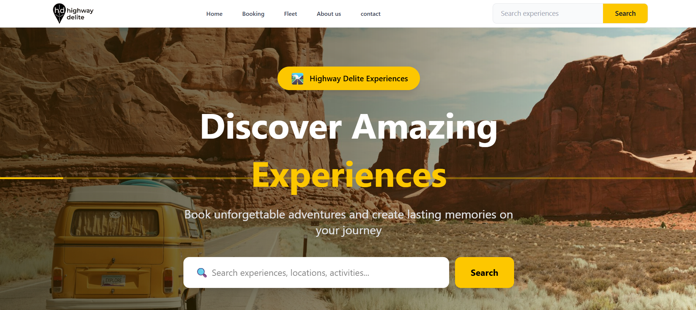

# Bookit — Experiences & Slots

Highway Delite is a modern web application that allows users to **discover, book, and manage travel experiences across India**. Built as a full-stack application, it provides seamless browsing, search, and booking functionalities for travelers.

**Live Application:** [BookIt](https://book-it-highway-delite-nine.vercel.app)  
**Repository:** [GitHub-BookIt](https://github.com/believeharsh/BookIt-Highway-Delite)

<!--  -->

---

## Features

Highway Delite offers a comprehensive set of features designed for a smooth travel booking experience:

* **Discovery & Search:** Browse and search experiences by **category**, **location**, and **activity type**.
* **Filtering:** Filter experiences **dynamically** based on user selection.
* **Detailed View:** View detailed experience pages with an **image gallery**, **highlights**, and **included/excluded details**.
* **Booking Flow:** Select **slots** and the **number of participants** for booking.
* **Responsive Design:** Fully **responsive** design optimized for both mobile and desktop screens.
* **Admin Tools:** Includes **admin scripts** for seeding initial data (experiences, promo codes, and slots).
* **Checkout:** Complete **booking summary and checkout flow**.

---

## Tech Stack

The application is built using a modern, robust technology stack:

### Frontend
* **Framework:** React (with **TypeScript**)
* **State Management:** **Redux Toolkit**
* **Styling:** **Tailwind CSS**
* **Routing:** **React Router**

### Backend
* **Runtime/Framework:** **Node.js** with **Express**
* **Database:** **MongoDB**
* **ORM/ODM:** **Mongoose** for schema and models
* **Language:** **TypeScript** for type safety

### Other Tools
* **Image Storage:** **Cloudinary**

---

## Project Structure

```
src/
├── components/          # UI components (CheckoutForm, PriceBreakDown, Slotselector)
├── context/             # Global state management
├── services/            # API integration (api.ts)
├── types/               # TypeScript definitions
├── App.tsx              # Root component
└── main.tsx             # Entry point
```

---

## Getting Started

### Prerequisites

- Node.js 18+
- npm or yarn
- Backend API running (see backend setup)

### Installation

1. **Clone the repository**

   ```bash
   git clone <your-repo-url>
   cd bookit-client
   ```

2. **Install dependencies**

   ```bash
   npm install
   ```

3. **Configure environment variables**

   Create a `.env` file:

   ```env
   VITE_API_URL=http://localhost:5000
   ```

4. **Start development server**

   ```bash
   npm run dev
   ```

   App runs at: `http://localhost:5173`

---

## Backend Setup

### Environment Variables

Create `.env` in backend directory:

```env
PORT=3000
NODE_ENV=development

# Database
MONGODB_URI=your_mongodb_connection_string

# App Config
CLIENT_URL=http://localhost:5173
NODE_ENV=development
```

### Start Backend

```bash
cd backend
npm install
npm run dev
```

Backend runs at: `http://localhost:8000`

---

## Building for Production

```bash
npm run build
```

Output will be in the `dist/` directory.


---

## API Endpoints

| Endpoint                     | Method | Description                     |
| ---------------------------- | ------ | ------------------------------- |
| `/api/promo/active`          | POST   | get the active promo's          |
| `/api/promo/validate`        | POST   | vlidating the promo code        |
| `/api/bookings`              | POST   | getting all the bookings        |
| `/api/bookings/:id`          | GET    | getting the booking by id       |
| `/api/experiences`           | GET    | getting the all the experiences |
| `/api/experiences/:id`       | GET    | getting the experience by id    |

---

## Screenshots

| Feature                | Preview                                                                       |
| ---------------------- | ---------------------------------------------------------------               |
| Hero Section           |                          |
| Experience Details     | |
| About                  |                           |
| Fleet                  |                           |
| Experience Explore     |      |

---

## Contributing

Contributions are welcome! Feel free to open issues or submit pull requests.

---

## License

MIT License - feel free to use for personal or commercial projects.

---


** Built By Harsh Dahiya associated Highway Delite ❤️ **